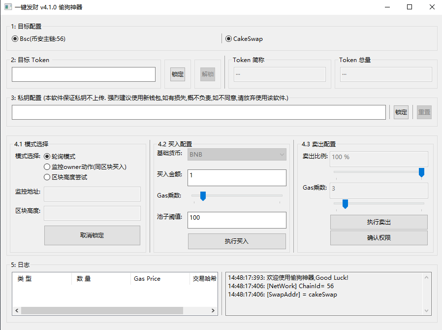

# 使用 FlashTrading 进行快速交易 

- 支持在windows上运行
- 支持mac(后续支持)

# 软件主界面

## FAQ
0.一键发财存在的意义是什么? 
> 抢狗软件可以无视swap页面的冗余操作,对合约快速发出请求,在时间上比较高效.
> 在土狗模式中,就是看谁进的快,跑的快.

1.版本背景
> 该版本免费推广版本, 同区块买入有局限性(仅支持项目方手动入池),加上部分判断及手工操作, 现作为免费推广版本
>> 完善版同区块买入版本将在收费版本中推出.

2.安全问题,软件是否会偷偷上传密钥?
> 不会,软件仅与(eth/bsc等)主网节点进行合约交互, 不上传任何密钥
> > 安全建议: 使用新钱包

3.是否支持mac/linux?
> mac及linux版本会在功能完善后推出

4.支持什么功能?
> 轮询模式, 同区块买入, 市价卖出等后续的迭代功能.

5.滑点是多少?
> 滑点设置的是无限大, 以矿工确认时的市价买入卖出.

6.有没有支持的社区群?
> 有

7.如何判断合约是否貔貅,或者时坑逼项目? 
> 抛到电报群空闲下来会帮你分析合约的源码, 如果合约没开源那就靠你对项目团队的感觉了.

