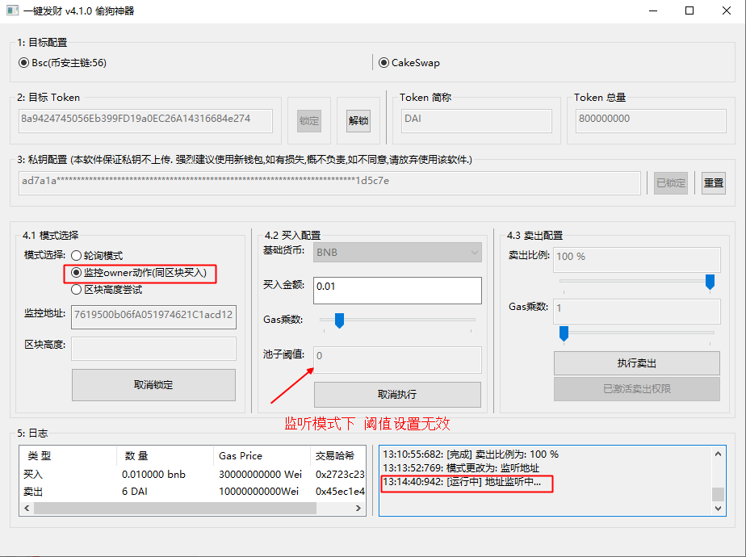
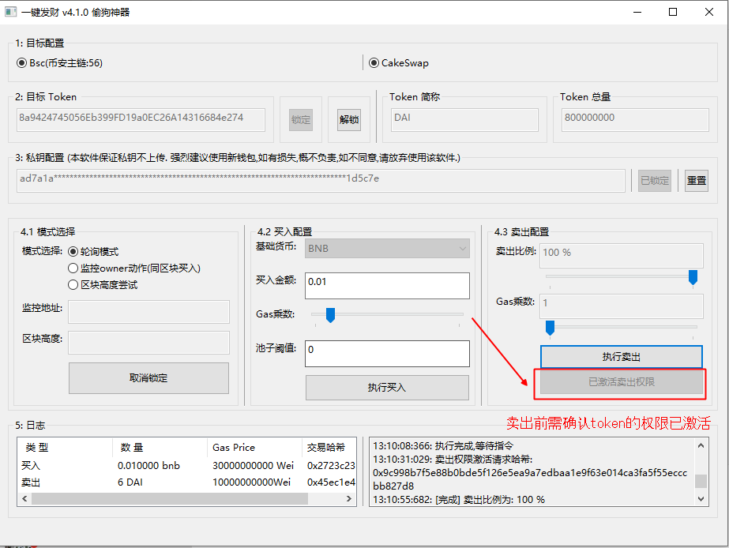

#模式原理介绍
### 轮询模式

    -gas乘数: 当前网络建议 gas 的倍数, 在交易池内,gas越高执行的优先级越高
    -池子阈值: 当池子深度大于该值时买入
> 原理: 启动了20个协程(毫秒级别)查询LP是否创建及深度,当池子的深度大于[阈值]的时候进行买入

> 使用方法: 填入参数后,启动执行,满足条件后会自动买入

### 同区块买入(半自动)

    - 监控地址: owner地址 (暂不支持合约[预售\]入池土狗,这里的owner多指创建者)
    - gas乘数: 该模式下 gas乘数 当设置为1 (需要保证同区块内的执行顺序在入池动作后)
    - 池子阈值: 当前模式下会忽略该参数
> 原理:监听owner地址的动作, 当owner地址起手(矿工确认前)一个动作时,尝试买入,如果该动作非入池动作,买入会失败.

> 使用方法: 参数配置完成后, 点击执行监听,产生动作后,会执行买入操作.按钮重置,点击继续执行,监听下一个动作. 

> 注意:因不确定起手动作是否为入池行为, 可以借助 poocoin 看是否有入池, 如果入池之后,点击终止监听.

### 极速卖出

    -卖出权限: 当买入的erc20激活后,才能够进行卖出交易.
    -卖出比例: 卖出持有总额的比例

>原理: 以当前市价(滑点无限大)执行快速卖出操作

>使用方法: 首先确认当前卖出权限是否激活, 激活后执行卖出即可.